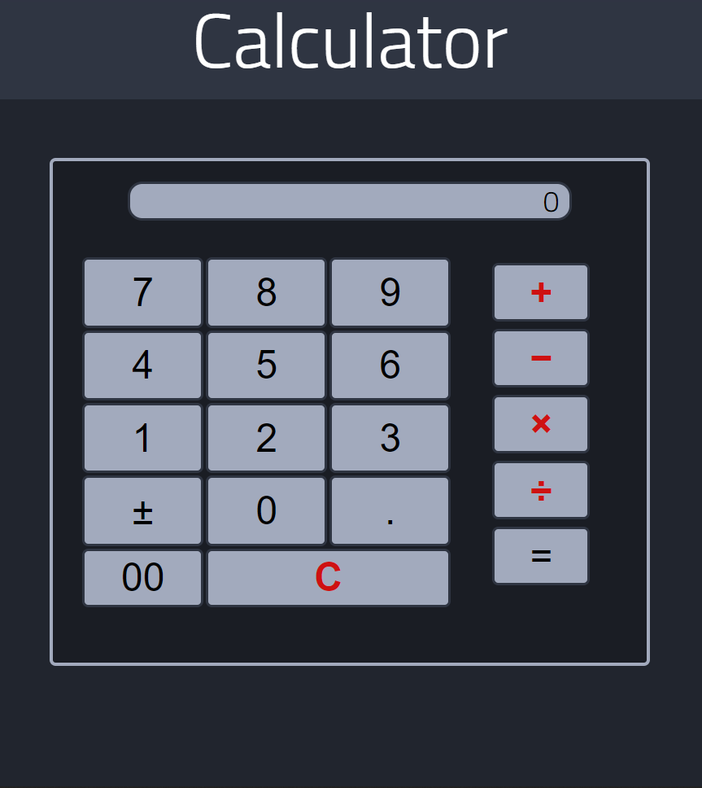
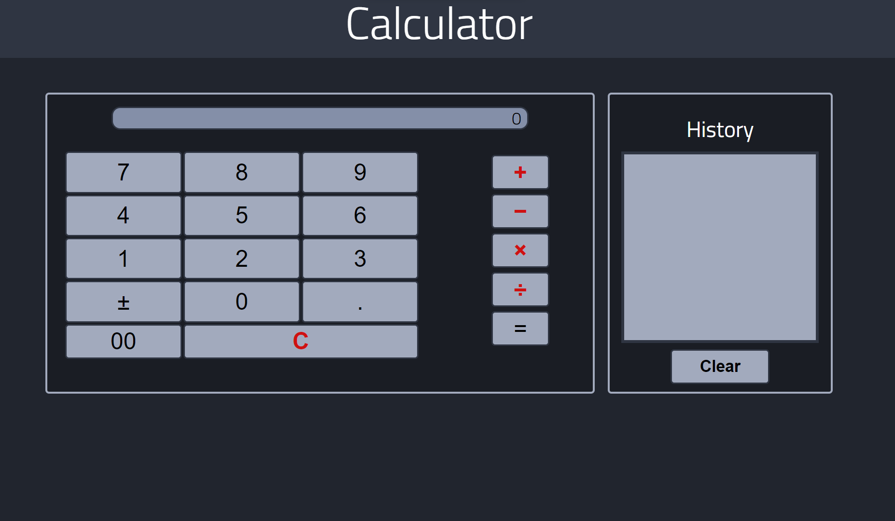
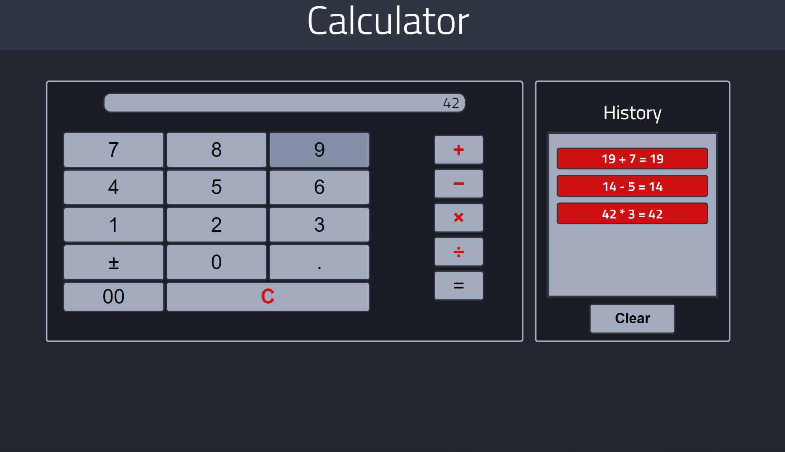

# Calculator JS

## Screenshots

 

## Description

A JavaScript application based on the Odin Project exercise - **'Calculator'**

**Features:**

- Modern User Interface
- Keyboard Support
- History Log

## What I've Learnt

+ Encapsulating modules

## Installation

To use this project, first clone the repo on your device using the command below:

`git init`

`https://github.com/tarwat-uddin/calculator-js.git`

## License

[GNU General Public License version 3](https://opensource.org/licenses/GPL-3.0)
